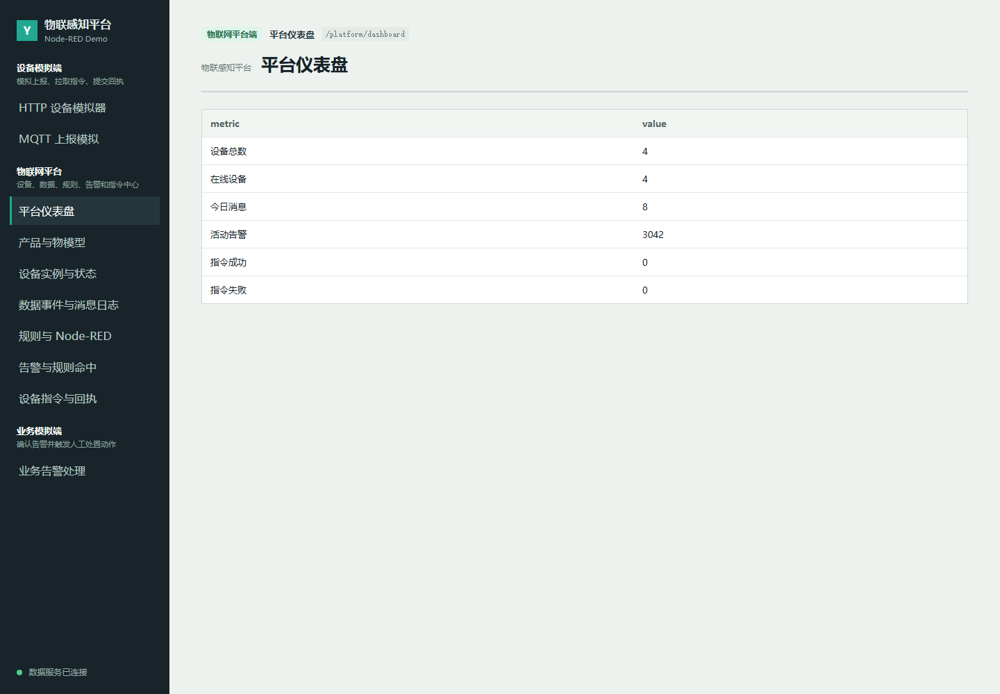
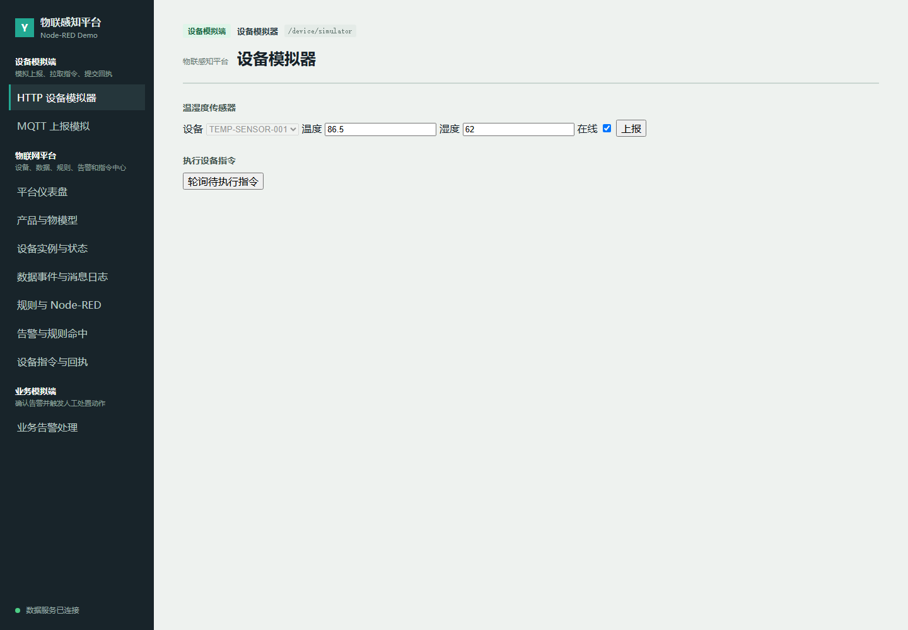
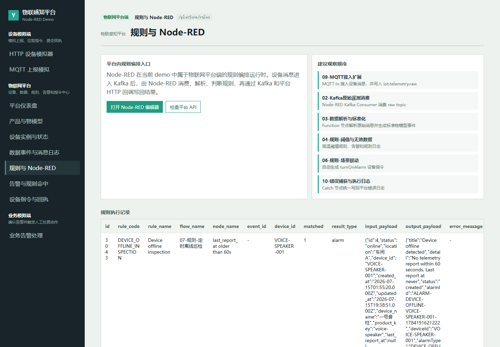
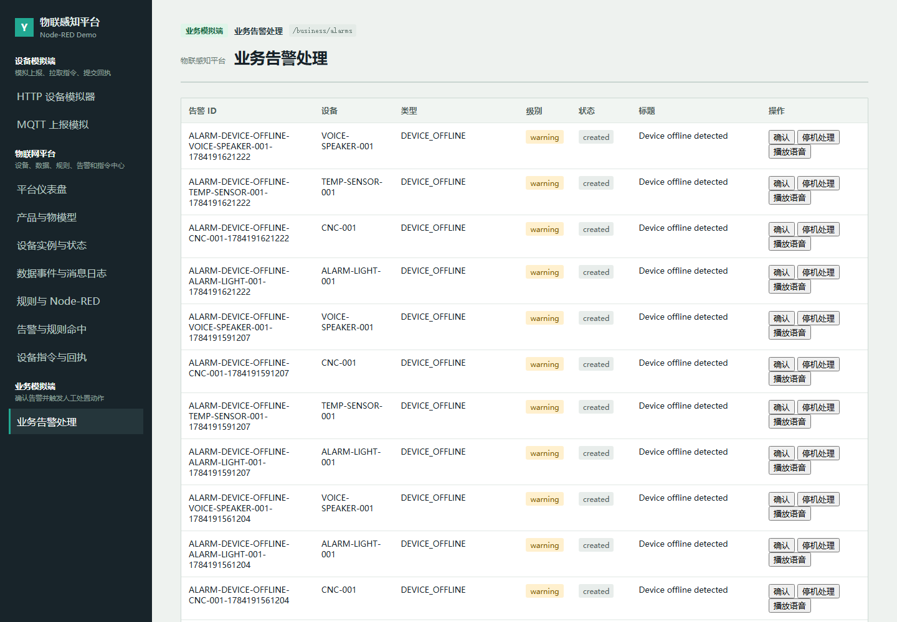

# 物联感知平台 Node-RED Demo

语言：中文 | [English](README.en.md)

这是一个用于技术分享和本地演示的物联感知平台 demo。它用 Node.js/Express 提供平台 API，用 React/Vite 提供 Web 页面，用 MySQL 持久化产品、设备、遥测、告警、规则日志和指令，用 Kafka 承载事件流，并用 Node-RED 展示规则编排与流程执行。

本 demo 的重点不是做完整生产级平台，而是跑通一个可讲解的闭环：

```text
设备模拟上报
  -> HTTP / MQTT 接入
  -> Kafka raw topic
  -> Node-RED 解析、标准化、规则判断
  -> 平台 API 写入 MySQL
  -> Web 页面查看告警、规则命中、指令和回执
```

## 系统界面

平台仪表盘：



设备模拟端：



规则与 Node-RED：



业务告警处理：



## 目录结构

```text
iot-platform-nodered-demo/
  server/      平台 API、业务 API、设备模拟 API
  web/         React/Vite 演示页面
  node-red/    Node-RED flows、settings 和运行依赖
  docs/        使用教程、Node-RED 说明、技术分享材料
```

## 前置条件

本地需要准备：

1. Node.js 和 pnpm。
2. Docker Desktop 或可用 Docker Engine。
3. MySQL 服务，用于存储产品、设备、遥测、告警、规则日志和指令。
4. Kafka 服务，用于承载设备上报、规则事件、告警和指令消息。
5. MQTT 演示需要额外准备 EMQX。

本项目不强制要求固定容器名或 Docker network。只要服务地址、账号密码和项目配置一致即可。

可参考 note_cloud 仓库中的 compose 样例：

- [MySQL compose](https://github.com/lylyuanliang/note_cloud/tree/main/%E7%AC%94%E8%AE%B0/%E5%AD%A6%E4%B9%A0%E8%AE%B0%E5%BD%95/docker/1.docker-compose%E6%96%87%E4%BB%B6%E6%A0%B7%E4%BE%8B/compose/mysql)
- [Kafka compose](https://github.com/lylyuanliang/note_cloud/tree/main/%E7%AC%94%E8%AE%B0/%E5%AD%A6%E4%B9%A0%E8%AE%B0%E5%BD%95/docker/1.docker-compose%E6%96%87%E4%BB%B6%E6%A0%B7%E4%BE%8B/compose/kafka)
- [EMQX compose](https://github.com/lylyuanliang/note_cloud/tree/main/%E7%AC%94%E8%AE%B0/%E5%AD%A6%E4%B9%A0%E8%AE%B0%E5%BD%95/docker/1.docker-compose%E6%96%87%E4%BB%B6%E6%A0%B7%E4%BE%8B/compose/emqx)
- [Node-RED compose](https://github.com/lylyuanliang/note_cloud/tree/main/%E7%AC%94%E8%AE%B0/%E5%AD%A6%E4%B9%A0%E8%AE%B0%E5%BD%95/docker/1.docker-compose%E6%96%87%E4%BB%B6%E6%A0%B7%E4%BE%8B/compose/node-red)

## 安装依赖

新电脑从 GitHub 克隆：

```powershell
git clone git@github.com:lylyuanliang/iot-platform-nodered-demo.git
cd iot-platform-nodered-demo
```

如果是在当前本机目录继续操作，进入项目目录：

```powershell
cd "D:\file_save\workspace\工作内容\ydcloudplus平台\物联感知\iot-platform-nodered-demo"
```

安装 workspace 依赖：

```powershell
pnpm install
```

## 初始化数据库

推荐用下面的命令导入，显式指定 `utf8mb4`，避免中文 seed 乱码：

下面命令假设 MySQL 容器名为 `mysql`、账号密码为 `root/root`；如果你的环境不同，替换为自己的连接方式即可。

```powershell
Get-Content -Raw server\src\db\schema.sql | docker exec -i mysql mysql --default-character-set=utf8mb4 -uroot -proot
Get-Content -Raw server\src\db\seed.sql | docker exec -i mysql mysql --default-character-set=utf8mb4 -uroot -proot
```

检查表：

```powershell
docker exec mysql mysql --default-character-set=utf8mb4 -uroot -proot -D iot_nodered_demo -e "SHOW TABLES;"
```

## 创建 Kafka Topic

下面命令假设 Kafka 容器名为 `kafka-kraft`，容器内 Kafka 命令路径为 `/opt/kafka/bin/kafka-topics.sh`；如果你的 Kafka 部署方式不同，使用等价的 topic 创建命令即可。

```powershell
$topics = @(
  "iot.telemetry.raw",
  "iot.telemetry.normalized",
  "iot.invalid.data",
  "iot.rule.matched",
  "iot.alarm.created",
  "iot.command.downlink",
  "iot.command.ack"
)

foreach ($topic in $topics) {
  docker exec kafka-kraft /opt/kafka/bin/kafka-topics.sh `
    --bootstrap-server localhost:9092 `
    --create --if-not-exists `
    --topic $topic `
    --partitions 1 `
    --replication-factor 1
}
```

## 启动服务

启动后端 API：

```powershell
pnpm server:dev
```

另开一个 PowerShell，启动 Web：

```powershell
pnpm web:dev
```

后端健康检查：

```text
http://127.0.0.1:3000/api/health
```

页面入口：

```text
http://127.0.0.1:5173/#/platform/dashboard
```

注意：`http://127.0.0.1:3000/` 是 API 服务根路径，当前 demo 不在这里提供页面，浏览器显示 `Cannot GET /` 是正常的。

## 启动 Node-RED

当前 demo 实测使用项目内 pnpm 启动 Node-RED，便于直接加载本项目的 `flows.json`、`settings.js` 和 KafkaJS 节点：

```powershell
cd node-red
pnpm exec node-red --userDir .
```

打开：

```text
http://127.0.0.1:1880
```

如果没有自动加载流程，在 Node-RED 页面中导入：

```text
node-red/flows.json
```

导入后点击 `Deploy`。

仓库中已提交的 Node-RED flow 样例是：

```text
node-red/flows.json
```

新电脑 clone 后，按上面的命令启动 Node-RED 即可加载该 flow；如果页面没有自动显示，手动导入 `node-red/flows.json`。

以下文件不会提交到 Git：

```text
node-red/flows_cred.json
node-red/.config*.json
node-red/*.backup
```

这些文件属于本地运行时状态、编辑器偏好或凭据密文。当前 demo 的 flow 不依赖真实账号密码；如果未来配置了 MQTT 账号、HTTP token、证书等凭据，需要在新环境中重新配置。

## MQTT / EMQX

MQTT Broker 使用 EMQX。compose 文件记录在：

[EMQX compose](https://github.com/lylyuanliang/note_cloud/blob/main/%E7%AC%94%E8%AE%B0/%E5%AD%A6%E4%B9%A0%E8%AE%B0%E5%BD%95/docker/1.docker-compose%E6%96%87%E4%BB%B6%E6%A0%B7%E4%BE%8B/compose/emqx/docker-compose.yml)

启动：

```powershell
cd "D:\file_save\workspace\note_cloud\笔记\学习记录\docker\1.docker-compose文件样例\compose\emqx"
docker compose up -d
```

地址：

```text
MQTT: 127.0.0.1:1883
Dashboard: http://127.0.0.1:18083
```

## Web 页面

当前 Web 页面包括：

| 端 | 路由 | 页面 |
| --- | --- | --- |
| 设备模拟端 | `#/device/simulator` | HTTP 设备模拟器 |
| 设备模拟端 | `#/device/mqtt-simulator` | MQTT 上报模拟 |
| 物联网平台端 | `#/platform/dashboard` | 平台仪表盘 |
| 物联网平台端 | `#/platform/products` | 产品与物模型 |
| 物联网平台端 | `#/platform/devices` | 设备实例与状态 |
| 物联网平台端 | `#/platform/telemetry` | 数据事件与消息日志 |
| 物联网平台端 | `#/platform/rules` | 规则与 Node-RED |
| 物联网平台端 | `#/platform/alarms` | 告警与规则命中 |
| 物联网平台端 | `#/platform/commands` | 设备指令与回执 |
| 业务模拟端 | `#/business/alarms` | 业务告警处理 |

父级路由 `#/device`、`#/platform`、`#/business` 会分别进入设备模拟端、物联网平台端和业务模拟端的默认页面。

设备模拟端当前能力：

1. 模拟 `TEMP-SENSOR-001` 上报温度、湿度、在线状态。
2. 触发普通温度和高温两类上报场景。
3. 通过 MQTT 页面触发 EMQX -> Node-RED -> Kafka raw 的接入流程。
4. 轮询 `ALARM-LIGHT-001`、`CNC-001`、`VOICE-SPEAKER-001` 三类执行设备的待执行指令。
5. 对设备指令提交 `success`、`failed`、`timeout` 三种回执。

## 推荐演示流程

1. 打开 `http://127.0.0.1:5173/#/platform/dashboard`。
2. 在“产品与物模型”确认产品和物模型中文正常显示。
3. 在“设备模拟端 / 设备模拟器”上报普通温度，例如 `25.5`。
4. 在“数据事件与消息日志”查看 raw 和 normalized 数据。
5. 在“设备模拟端 / 设备模拟器”上报高温，例如 `86.5`。
6. 在“告警与规则命中”查看 `HIGH_TEMPERATURE` 告警。
7. 在“设备指令与回执”查看 `turnOnAlarm -> ALARM-LIGHT-001`。
8. 回到“设备模拟端 / 设备模拟器”，点击“轮询待执行指令”，再点击“成功”。
9. 在“设备模拟端 / MQTT 上报模拟”点击“发布高温 MQTT 上报”，观察 MQTT 路径复用同一套规则链路。
10. 在“业务模拟端 / 业务告警处理”点击“确认”，再点击“停机处理”或“播放语音”。
11. 再次在“设备模拟端 / 设备模拟器”轮询并回执业务指令。

更详细的操作手册见：

```text
docs/当前Demo使用教程.md
```

## Node-RED Flow

当前主要 flow tab：

| Tab | 作用 |
| --- | --- |
| `02-Kafka原始遥测消费` | 消费 `iot.telemetry.raw` |
| `03-数据解析与标准化` | 原始数据解析、校验、写 normalized |
| `04-规则-阈值与无效数据` | 高温阈值规则、无效数据处理 |
| `05-规则-连续异常窗口` | 连续 3 次高温触发严重告警 |
| `06-规则-场景联动` | 高温自动生成 `turnOnAlarm` |
| `07-规则-定时离线巡检` | 定时检查离线设备 |
| `09-MQTT接入扩展` | MQTT 消息写入 Kafka raw |
| `10-错误捕获与执行日志` | 捕获流程异常并写日志 |

## 常用验证命令

测试后端：

```powershell
pnpm --filter demo-server test
```

构建前端：

```powershell
pnpm --filter demo-web build
```

检查中文 API：

```powershell
Invoke-RestMethod http://127.0.0.1:3000/api/products | ConvertTo-Json -Depth 6
```

时间显示说明：

- demo-server 的 MySQL 连接会话使用 `+08:00`。
- Web 表格会把时间字段格式化为北京时间 `YYYY-MM-DD HH:mm:ss`。
- 修改后如果页面仍显示旧的 ISO 时间，先重启 `pnpm server:dev` 和 `pnpm web:dev`，Node-RED 时间字段相关修正还需要重启 Node-RED 或在编辑器中点击 `Deploy`。

## 更多文档

- 当前 Demo 使用教程：`docs/当前Demo使用教程.md`
- Node-RED 详细说明：`docs/Node-RED详细说明.md`
- 技术分享提纲：`docs/技术分享提纲.md`
- Node-RED 运行说明：`node-red/README.md`
