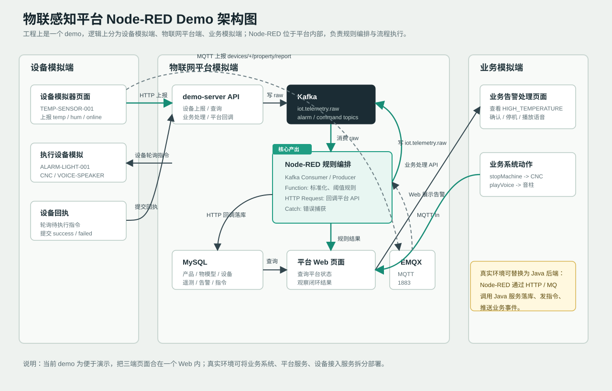

# 当前 Demo 使用教程

本文用于从零启动并试跑当前物联感知平台 Node-RED demo。目标是让你能自己验证完整闭环，并能在技术分享前反复演练。

## 1. Demo 包含什么

当前 demo 由几部分组成：

```text
设备模拟端
  -> HTTP / MQTT 上报
  -> Kafka raw topic
  -> Node-RED 规则编排
  -> 平台 API / MySQL
  -> Web 页面查询、业务处理、设备指令回执
```

架构图：



逻辑上的三端对应关系：

| 设想中的端 | 当前 demo 对应 | 说明 |
| --- | --- | --- |
| 设备模拟端 | `#/device/simulator` | 模拟设备上报、设备拉取指令、设备提交回执 |
| 物联网平台端 | `#/platform/*`、demo-server、Kafka、MySQL、Node-RED | 平台 API、事件流、规则编排、状态持久化和页面查询 |
| 业务模拟端 | `#/business/alarms` | 模拟业务系统查看告警、人工确认、触发停机或语音指令 |

工程上当前 demo 为了方便启动和演示，把三端页面放在同一个 React Web 内；逻辑上仍按“设备端、平台端、业务端”分工。真实环境中，业务系统、Java 后端平台服务、设备接入服务可以拆分部署，Node-RED 仍作为平台内部的规则编排组件。

核心组件：

| 组件 | 地址/端口 | 作用 |
| --- | --- | --- |
| demo-server | `http://127.0.0.1:3000` | 平台 API、业务 API、设备模拟 API |
| demo-web | `http://127.0.0.1:5173` | 页面演示入口 |
| Node-RED | `http://127.0.0.1:1880` | 规则编排与流程执行 |
| MySQL | `127.0.0.1:3306` | 存储产品、设备、遥测、告警、指令、规则日志 |
| Kafka | `127.0.0.1:9092` | 遥测、规则、告警、指令事件流 |
| EMQX | `127.0.0.1:1883` | MQTT Broker |
| EMQX Dashboard | `http://127.0.0.1:18083` | MQTT Broker 管理界面 |

## 2. 目录位置

主目录：

```powershell
D:\file_save\workspace\工作内容\ydcloudplus平台\物联感知\iot-platform-nodered-demo
```

Node-RED flow：

```powershell
iot-platform-nodered-demo\node-red\flows.json
```

EMQX compose：

```powershell
D:\file_save\workspace\note_cloud\笔记\学习记录\docker\1.docker-compose文件样例\compose\emqx\docker-compose.yml
```

Node-RED compose 样例：

```powershell
D:\file_save\workspace\note_cloud\笔记\学习记录\docker\1.docker-compose文件样例\compose\node-red\docker-compose.yml
```

本 demo 实测使用的是项目内 pnpm 方式启动 Node-RED，便于直接加载本目录的 `flows.json` 和 KafkaJS 依赖。

## 3. 前置条件

需要本机具备：

1. Docker Desktop 或可用 Docker Engine。
2. Node.js / pnpm。
3. 本机已有 Kafka 容器 `kafka-kraft`。
4. 本机已有 MySQL 容器 `mysql`，账号密码为 `root/root`。
5. Docker network `liurl_net` 存在。

检查容器：

```powershell
docker ps --format "{{.Names}} `t {{.Status}} `t {{.Ports}}"
```

预期至少看到：

```text
mysql
kafka-kraft
```

检查网络：

```powershell
docker network inspect liurl_net --format "{{.Name}}"
```

## 4. 安装依赖

进入 demo 目录：

```powershell
cd "D:\file_save\workspace\工作内容\ydcloudplus平台\物联感知\iot-platform-nodered-demo"
```

安装依赖：

```powershell
pnpm install
```

当前 workspace 包括：

```text
server
web
node-red
```

其中 `node-red` 包含：

1. `node-red` 运行时。
2. `node-red-contrib-kafkajs` KafkaJS 节点。

## 5. 初始化数据库

导入 schema：

```powershell
Get-Content -Raw server\src\db\schema.sql | docker exec -i mysql mysql --default-character-set=utf8mb4 -uroot -proot
```

导入 seed：

```powershell
Get-Content -Raw server\src\db\seed.sql | docker exec -i mysql mysql --default-character-set=utf8mb4 -uroot -proot
```

检查表：

```powershell
docker exec mysql mysql --default-character-set=utf8mb4 -uroot -proot -D iot_nodered_demo -e "SHOW TABLES;"
```

核心表：

```text
product
thing_model
device_instance
telemetry_raw_log
telemetry_event
device_latest_state
rule_execution_log
alarm_record
command_record
```

## 6. 准备 Kafka Topic

创建所需 topic：

```powershell
$topics = @(
  "iot.telemetry.raw",
  "iot.telemetry.normalized",
  "iot.invalid.data",
  "iot.rule.matched",
  "iot.alarm.created",
  "iot.command.downlink",
  "iot.command.ack"
)

foreach ($topic in $topics) {
  docker exec kafka-kraft /opt/kafka/bin/kafka-topics.sh `
    --bootstrap-server localhost:9092 `
    --create --if-not-exists `
    --topic $topic `
    --partitions 1 `
    --replication-factor 1
}
```

查看 topic：

```powershell
docker exec kafka-kraft /opt/kafka/bin/kafka-topics.sh --bootstrap-server localhost:9092 --list
```

## 7. 启动 EMQX

进入 EMQX compose 目录：

```powershell
cd "D:\file_save\workspace\note_cloud\笔记\学习记录\docker\1.docker-compose文件样例\compose\emqx"
```

校验 compose：

```powershell
docker compose config
```

启动：

```powershell
docker compose up -d
```

检查端口：

```powershell
Test-NetConnection 127.0.0.1 -Port 1883
Test-NetConnection 127.0.0.1 -Port 18083
```

访问：

```text
http://127.0.0.1:18083
```

如果页面要求登录，按 EMQX 当前镜像页面提示处理。常见默认账号是 `admin`，默认密码是 `public`，首次登录后建议立即修改。

## 8. 启动平台服务

回到 demo 目录：

```powershell
cd "D:\file_save\workspace\工作内容\ydcloudplus平台\物联感知\iot-platform-nodered-demo"
```

启动 server：

```powershell
pnpm server:dev
```

另开一个 PowerShell，启动 web：

```powershell
cd "D:\file_save\workspace\工作内容\ydcloudplus平台\物联感知\iot-platform-nodered-demo"
pnpm web:dev
```

检查 server：

```powershell
Invoke-RestMethod http://127.0.0.1:3000/api/health
```

预期：

```json
{
  "ok": true,
  "service": "iot-platform-nodered-demo"
}
```

注意：`http://127.0.0.1:3000/` 是后端 API 服务根路径，当前 demo 没有在这个路径提供页面，所以浏览器显示 `Cannot GET /` 属于正常现象。页面入口是下面的 `5173`。

打开 web：

```text
http://127.0.0.1:5173/#/platform/dashboard
```

## 9. 启动 Node-RED

在 demo 目录下执行：

```powershell
cd "D:\file_save\workspace\工作内容\ydcloudplus平台\物联感知\iot-platform-nodered-demo\node-red"
pnpm exec node-red --userDir .
```

打开：

```text
http://127.0.0.1:1880
```

正常日志应包含：

```text
Node-RED version: v5.0.1
Server now running at http://127.0.0.1:1880/
Connected to broker: nodered-iot-demo@mqtt://127.0.0.1:1883
Consumer has joined the group
```

如果 Node-RED 没自动加载 flow，在页面中：

1. 点击右上角菜单。
2. 选择 `Import`。
3. 选择 `node-red/flows.json`。
4. 导入后点击 `Deploy`。

## 10. Web 页面说明

当前 web 是轻量 demo 页面，核心用于观察闭环数据。

当前页面按三端路由分组：

| 端 | 路由 | 作用 |
| --- | --- | --- |
| 设备模拟端 | `#/device/simulator` | 设备上报、查询待执行指令、提交回执 |
| 设备模拟端 | `#/device/mqtt-simulator` | 通过 Web 触发 MQTT 设备属性上报 |
| 物联网平台端 | `#/platform/dashboard` | 平台汇总指标 |
| 物联网平台端 | `#/platform/products` | 产品、属性、事件、服务定义 |
| 物联网平台端 | `#/platform/devices` | 设备实例和最新状态 |
| 物联网平台端 | `#/platform/telemetry` | raw 和 normalized 数据 |
| 物联网平台端 | `#/platform/rules` | 平台内 Node-RED 规则编排入口和规则执行记录 |
| 物联网平台端 | `#/platform/alarms` | 告警和规则命中记录 |
| 物联网平台端 | `#/platform/commands` | 设备指令和回执 |
| 业务模拟端 | `#/business/alarms` | 业务人工确认告警，触发业务指令 |

父级路由也可直接访问：

| 父级路由 | 默认进入 |
| --- | --- |
| `#/device` | `#/device/simulator` |
| `#/platform` | `#/platform/dashboard` |
| `#/business` | `#/business/alarms` |

设备模拟端当前能做的事情：

1. 模拟 `TEMP-SENSOR-001` 上报温度、湿度、在线状态。
2. 通过 HTTP 普通温度验证链路不误报。
3. 通过 HTTP 高温上报触发 Node-RED 阈值规则和自动联动。
4. 通过 MQTT 页面向 EMQX 发布设备属性上报，进入 `09-MQTT接入扩展`。
5. 轮询 `ALARM-LIGHT-001`、`CNC-001`、`VOICE-SPEAKER-001` 三类执行设备的待执行指令。
6. 对待执行指令提交 `success`、`failed`、`timeout` 三种回执，完成“平台下发 -> 设备执行 -> 平台回执”的闭环。

### 10.1 服务启动后的页面操作手册

下面这部分是“所有服务都启动好以后”的页面演练顺序。建议第一次演示只按这个顺序操作，命令行验证作为辅助。

#### 10.1.1 打开系统并确认基础数据

1. 打开 web：

```text
http://127.0.0.1:5173/#/platform/dashboard
```

2. 进入“平台仪表盘”，确认页面能正常加载指标：
   - `设备总数`
   - `在线设备`
   - `今日消息`
   - `活动告警`
   - `指令成功`
   - `指令失败`

3. 进入“产品与物模型”，确认能看到产品和物模型定义。演示时重点说明：
   - `property` 表示设备属性，例如温度、湿度、在线状态。
   - `event` 表示设备或平台事件。
   - `service` 表示平台可下发给设备执行的服务能力。

4. 进入“设备实例与状态”，确认初始化设备存在：
   - `TEMP-SENSOR-001`：温湿度传感器，负责上报数据。
   - `ALARM-LIGHT-001`：声光报警器，接收自动告警指令。
   - `CNC-001`：数控设备，接收业务停机指令。
   - `VOICE-SPEAKER-001`：语音播报设备，接收业务语音指令。

#### 10.1.2 演练普通温度上报

1. 进入“设备模拟端 / 设备模拟器”，或直接打开 `http://127.0.0.1:5173/#/device/simulator`。
2. 在“温湿度传感器”区域设置：
   - 温度：`25.5`
   - 湿度：`62`
   - 在线：勾选
3. 点击“上报”。
4. 页面出现“上报已接受：...”后，进入“数据事件与消息日志”。
5. 在“原始上报”里查看 raw 消息，在“标准化事件”里查看 normalized 事件。
6. 进入“告警与规则命中”，确认这次普通温度不会产生 `HIGH_TEMPERATURE` 高温告警。

这一步用于证明链路已通，但规则没有误触发。

#### 10.1.3 演练高温自动告警闭环

1. 回到“设备模拟端 / 设备模拟器”。
2. 设置：
   - 温度：`86.5`
   - 湿度：`62`
   - 在线：勾选
3. 点击“上报”。
4. 等待 2 到 5 秒，让 Node-RED 消费 Kafka 并执行规则。
5. 进入“数据事件与消息日志”，确认本次上报已经产生标准化事件。
6. 进入“告警与规则命中”，确认能看到：
   - 告警类型：`HIGH_TEMPERATURE`
   - 规则来源：`HIGH_TEMP_AUTO_ALARM`
7. 进入“设备指令与回执”，确认平台生成了自动指令：
   - 目标设备：`ALARM-LIGHT-001`
   - 服务：`turnOnAlarm`
   - 指令来源：`rule`

这一步用于证明“设备上报 -> Node-RED 规则 -> 平台告警 -> 自动下发设备指令”的自动闭环。

#### 10.1.4 演练自动指令回执

1. 进入“设备模拟端 / 设备模拟器”。
2. 在“执行设备指令”区域点击“轮询待执行指令”。
3. 如果存在 `ALARM-LIGHT-001 / turnOnAlarm` 指令，点击该行的“成功”。
4. 进入“设备指令与回执”，确认对应指令状态变为 `success`。
5. 回到“平台仪表盘”，确认 `指令成功` 数量发生变化。

这一步用于证明“平台下发 -> 设备拉取 -> 设备执行 -> 回执成功”的指令闭环。

#### 10.1.5 演练业务人工处理闭环

业务人工处理用于演示“高风险动作不直接由规则自动执行，而是由业务人员确认后下发”。

1. 先按 `10.1.3` 再触发一次高温告警。
2. 进入“业务模拟端 / 业务告警处理”，或直接打开 `http://127.0.0.1:5173/#/business/alarms`。
3. 找到未关闭的高温告警，点击“确认”。
4. 选择一种业务动作：
   - 点击“停机处理”：平台生成 `stopMachine -> CNC-001` 指令。
   - 点击“播放语音”：平台生成 `playVoice -> VOICE-SPEAKER-001` 指令。
5. 进入“设备模拟端 / 设备模拟器”，点击“轮询待执行指令”。
6. 对 `CNC-001` 或 `VOICE-SPEAKER-001` 的待执行指令点击“成功”。如需演示异常，也可以点击“失败”或“超时”。
7. 进入“设备指令与回执”，确认业务指令状态变为 `success`，且 `command_source` 为 `business`。

这一步用于证明“告警产生 -> 人工确认 -> 业务处置 -> 设备执行 -> 回执”的人工闭环。

#### 10.1.6 演练 MQTT 上报路径

MQTT 上报可以直接通过设备模拟端页面触发：

```text
http://127.0.0.1:5173/#/device/mqtt-simulator
```

页面会调用 demo-server 的 `POST /api/device/mqtt-report`，由后端向本地 EMQX 发布 MQTT 消息。发布完成后仍然回到 Web 页面观察结果：

1. 进入“设备模拟端 / MQTT 上报模拟”。
2. 点击“发布普通 MQTT 上报”或“发布高温 MQTT 上报”。
2. 进入“数据事件与消息日志”，确认 MQTT 消息也进入 raw 和 normalized。
3. 进入“告警与规则命中”，确认高温 MQTT 消息同样触发 `HIGH_TEMPERATURE`。
4. 进入“设备指令与回执”，确认同样生成 `turnOnAlarm -> ALARM-LIGHT-001`。
5. 进入“设备模拟端 / 设备模拟器”，轮询并回执该指令。

这一步用于证明 MQTT 不是旁路能力，而是接入层不同，进入平台后的规则编排、告警、指令链路保持一致。

#### 10.1.7 观察 Node-RED 编排

演示 Web 闭环后，打开 Node-RED：

```text
http://127.0.0.1:1880
```

测试时建议先打开右侧调试面板：

1. 点击 Node-RED 右侧边栏的 `Debug` 图标。
2. 如果右侧边栏没展开，点击右上角侧栏按钮展开。
3. 在 Debug 面板顶部选择显示 `all nodes`。
4. 点击 Debug 面板里的清空按钮，先清掉旧日志。
5. 注意：Debug 面板不会自动显示所有节点日志。只有流程里接了 `debug` 节点，或者 Function 里调用了 `node.warn()` / `node.log()`，这里才会有输出。
6. 只观察流程时不要点 `Deploy`；只有修改节点、连线、Debug 节点或 Function 代码后才点 `Deploy`。

然后在 Web 端触发一次测试：

1. 打开 `http://127.0.0.1:5173/#/device/simulator`。
2. 点击普通温度上报，先验证 raw -> normalized。
3. 点击高温上报，再验证告警、规则日志和自动指令。
4. 回到 Node-RED，看 Debug 面板和节点状态变化。

Node-RED 中建议按这个顺序观察 tab：

1. `09-MQTT接入扩展`：MQTT 消息进入 Kafka raw topic。
2. `02-Kafka原始遥测消费`：消费 `iot.telemetry.raw`。
3. `03-数据解析与标准化`：把原始消息转换成平台标准事件。
4. `04-规则-阈值与无效数据`：判断温度阈值并生成告警、规则日志。
5. `06-规则-场景联动`：命中规则后生成 `turnOnAlarm` 自动指令。
6. `05-规则-连续异常窗口`：演示更复杂的连续异常规则。
7. `07-规则-定时离线巡检`：演示平台主动巡检类规则。

每个 tab 具体看这些点：

| tab | 看什么 | 正常现象 |
| --- | --- | --- |
| `02-Kafka原始遥测消费` | `消费原始遥测消息` 节点状态 | 触发上报后应有 consumer 活动，消息通过 link out 进入标准化 |
| `03-数据解析与标准化` | `解析并标准化遥测数据` Function | 普通温度和高温都会生成 `NORM-...` 标准事件 |
| `04-规则-阈值与无效数据` | `判断高温阈值大于 80` Function | 普通温度不输出，高温输出告警和规则执行日志 |
| `06-规则-场景联动` | `高温且在线自动联动` Function | 高温且在线时生成 `turnOnAlarm` 指令 |
| `05-规则-连续异常窗口` | `连续高温累计 3 次` Function | 连续 3 次高温后生成 `CONTINUOUS_HIGH_TEMPERATURE` 告警 |
| `07-规则-定时离线巡检` | 定时 Inject 和离线判断 Function | 每 30 秒检查一次设备最近上报时间 |
| `10-错误捕获与执行日志` | `格式化 Node-RED 错误` Function | Function 或 HTTP Request 报错时进入统一错误记录 |

`解析并标准化遥测数据` 是一个多输出 Function。它不是由 Node-RED 自动判断成功/失败，而是 Function 代码通过 `return` 数组决定走哪个输出口：

```text
return [成功消息, null]  -> 只走第 1 个输出口
return [null, 失败消息]  -> 只走第 2 个输出口
```

所以如果数据无效，只会进入无效数据分支，不会同时进入保存标准化遥测、发布标准化消息和规则判断分支。

如果 Debug 面板没有任何输出：

1. 先确认当前 flow 是否已经接了 `debug` 节点；没有接 Debug 节点时，面板为空是正常现象。
2. 临时在关键节点后面接一个 Debug 节点，输出选择 `complete msg object`。
3. 点击右上角 `Deploy`。
4. 重新在 Web 设备模拟端触发上报。
5. 如果仍然没有输出，再确认 Node-RED 是否启动、Kafka 是否运行、`iot.telemetry.raw` topic 是否已创建。
6. 打开 `02-Kafka原始遥测消费`，看 Kafka consumer 节点下方是否显示 connected 或 joined group 一类状态。
7. 排查结束后可以删除或禁用临时 Debug 节点，避免演示时日志过多。

#### 10.1.8 页面演示验收清单

一次完整演示建议至少确认这些结果：

| 检查项 | 预期结果 |
| --- | --- |
| 平台仪表盘 | 指标能加载，无接口错误 |
| 产品与物模型 | 能看到产品、属性、事件、服务 |
| 设备实例与状态 | 能看到四个初始化设备 |
| 普通温度上报 | 有 raw 和 normalized，无高温告警 |
| 高温上报 | 有 `HIGH_TEMPERATURE` 告警 |
| 自动规则 | 有 `HIGH_TEMP_AUTO_ALARM` 规则日志 |
| 自动指令 | 有 `turnOnAlarm -> ALARM-LIGHT-001` |
| 自动回执 | `turnOnAlarm` 指令变为 `success` |
| 业务处理 | 能生成 `stopMachine` 或 `playVoice` |
| 业务回执 | 业务指令变为 `success` |
| MQTT 上报 | MQTT 消息进入同一套规则和告警链路 |

## 11. 主闭环一：HTTP 设备上报

### 11.1 发送普通温度

```powershell
Invoke-RestMethod `
  -Uri http://127.0.0.1:3000/api/device/report `
  -Method Post `
  -ContentType "application/json" `
  -Body '{"deviceId":"TEMP-SENSOR-001","payload":{"temp":25.5,"hum":62,"online":true}}'
```

预期：

1. server 返回 `accepted=true`。
2. `telemetry_raw_log` 有 raw 记录。
3. Node-RED 消费 `iot.telemetry.raw`。
4. `telemetry_event` 有 normalized 记录。
5. 不触发高温告警。

### 11.2 发送高温

```powershell
Invoke-RestMethod `
  -Uri http://127.0.0.1:3000/api/device/report `
  -Method Post `
  -ContentType "application/json" `
  -Body '{"deviceId":"TEMP-SENSOR-001","payload":{"temp":86.5,"hum":62,"online":true}}'
```

预期：

1. 生成标准化遥测。
2. 触发 `HIGH_TEMPERATURE` 告警。
3. 写入 `HIGH_TEMP_AUTO_ALARM` 规则执行日志。
4. 生成 `turnOnAlarm` 指令给 `ALARM-LIGHT-001`。

检查 MySQL：

```powershell
docker exec mysql mysql --default-character-set=utf8mb4 -uroot -proot -D iot_nodered_demo -e "
SELECT event_id, raw_event_id, device_id, properties_json FROM telemetry_event ORDER BY id DESC LIMIT 5;
SELECT alarm_id, alarm_type, source_rule_code, status FROM alarm_record ORDER BY id DESC LIMIT 5;
SELECT rule_code, device_id, matched, result_type FROM rule_execution_log ORDER BY id DESC LIMIT 5;
SELECT command_id, device_id, service_code, command_source, status FROM command_record ORDER BY id DESC LIMIT 5;
"
```

## 12. 主闭环二：MQTT 设备上报

Node-RED 的 `09-MQTT接入扩展` 已启用，订阅：

```text
devices/+/property/report
```

链路：

```text
MQTT -> Node-RED MQTT In -> iot.telemetry.raw -> Kafka raw consumer -> 标准化 -> 阈值规则 -> 告警 -> turnOnAlarm
```

### 12.1 通过 Web 页面发布 MQTT 消息

1. 打开 `http://127.0.0.1:5173/#/device/mqtt-simulator`。
2. 确认发布目标为 `devices/TEMP-SENSOR-001/property/report`。
3. 点击“发布普通 MQTT 上报”，验证 MQTT 接入但不触发高温告警。
4. 点击“发布高温 MQTT 上报”，验证 MQTT 接入后复用同一套高温规则、告警和指令链路。
5. 打开 Node-RED 的 `09-MQTT接入扩展`，观察 `订阅 MQTT 设备属性上报 -> 解析 JSON 消息 -> 转换 MQTT 原始遥测 -> 发布原始遥测消息`。

### 12.2 通过命令行发布 MQTT 消息

如果你本机没有 MQTT CLI，可以直接用 Node.js 发送一个最小 MQTT 3.1.1 报文：

```powershell
$eventId = "MQTT-MANUAL-" + (Get-Date -Format "yyyyMMddHHmmss")
$payload = @{
  deviceId = "TEMP-SENSOR-001"
  eventId = $eventId
  payload = @{
    temp = 86.5
    hum = 62
    online = $true
  }
} | ConvertTo-Json -Compress

$env:MQTT_PAYLOAD = $payload

@'
const net = require("net");
const payload = Buffer.from(process.env.MQTT_PAYLOAD);
const topic = Buffer.from("devices/TEMP-SENSOR-001/property/report");

function encLen(len) {
  const out = [];
  do {
    let digit = len % 128;
    len = Math.floor(len / 128);
    if (len > 0) digit |= 128;
    out.push(digit);
  } while (len > 0);
  return Buffer.from(out);
}

function str(value) {
  const b = Buffer.from(value);
  return Buffer.concat([Buffer.from([b.length >> 8, b.length & 255]), b]);
}

const clientId = "manual-publisher-" + Date.now();
const connectVar = Buffer.concat([str("MQTT"), Buffer.from([4, 2, 0, 30]), str(clientId)]);
const connect = Buffer.concat([Buffer.from([0x10]), encLen(connectVar.length), connectVar]);
const publishVar = Buffer.concat([Buffer.from([topic.length >> 8, topic.length & 255]), topic]);
const publish = Buffer.concat([Buffer.from([0x30]), encLen(publishVar.length + payload.length), publishVar, payload]);
const disconnect = Buffer.from([0xe0, 0x00]);

const socket = net.createConnection({ host: "127.0.0.1", port: 1883 }, () => socket.write(connect));
socket.on("data", (data) => {
  if (data[0] === 0x20 && data[3] === 0) {
    socket.write(publish);
    setTimeout(() => {
      socket.write(disconnect);
      socket.end();
    }, 200);
  }
});
socket.on("close", () => console.log("published"));
socket.on("error", (err) => {
  console.error(err);
  process.exit(1);
});
'@ | node -

$eventId
```

### 12.2 验证 Kafka raw

把上一步输出的 `$eventId` 替换进命令：

```powershell
docker exec kafka-kraft /opt/kafka/bin/kafka-console-consumer.sh `
  --bootstrap-server localhost:9092 `
  --topic iot.telemetry.raw `
  --from-beginning `
  --timeout-ms 5000 |
  Select-String -Pattern "MQTT-MANUAL"
```

### 12.3 验证 MySQL 闭环

```powershell
docker exec mysql mysql --default-character-set=utf8mb4 -uroot -proot -D iot_nodered_demo -e "
SELECT event_id, raw_event_id, device_id, event_type, properties_json
FROM telemetry_event
WHERE raw_event_id LIKE 'MQTT-MANUAL-%'
ORDER BY id DESC LIMIT 5;

SELECT alarm_id, device_id, alarm_type, source_rule_code, status
FROM alarm_record
WHERE source_event_id LIKE 'NORM-MQTT-MANUAL-%'
ORDER BY id DESC LIMIT 5;

SELECT rule_code, device_id, matched, result_type
FROM rule_execution_log
WHERE event_id LIKE 'NORM-MQTT-MANUAL-%'
ORDER BY id DESC LIMIT 5;

SELECT command_id, device_id, service_code, command_source, status
FROM command_record
WHERE command_id LIKE '%MQTT-MANUAL-%'
ORDER BY id DESC LIMIT 5;
"
```

## 13. 主闭环三：设备指令回执

高温规则会自动生成：

```text
turnOnAlarm -> ALARM-LIGHT-001
```

### 13.1 查询设备待执行指令

```powershell
Invoke-RestMethod http://127.0.0.1:3000/api/device/ALARM-LIGHT-001/commands
```

返回的指令会从 `sent` 转为 `running`。

### 13.2 提交成功回执

把 `commandId` 替换为查询到的指令 ID：

```powershell
Invoke-RestMethod `
  -Uri http://127.0.0.1:3000/api/device/command-ack `
  -Method Post `
  -ContentType "application/json" `
  -Body '{"commandId":"替换为实际commandId","deviceId":"ALARM-LIGHT-001","status":"success","ackPayload":{"message":"alarm light turned on"}}'
```

预期：

```text
command_record.status = success
iot.command.ack 有回执消息
```

## 14. 主闭环四：业务人工处理告警

业务人工处理用于演示“高风险动作不直接由规则自动执行”。

推荐流程：

1. 先用 HTTP 或 MQTT 触发高温告警。
2. 打开 web 的“业务告警处理”页面。
3. 点击 `确认`。
4. 点击 `停机处理` 或 `播放语音`。
5. 平台生成业务指令：
   - `stopMachine -> CNC-001`
   - `playVoice -> VOICE-SPEAKER-001`
6. 进入设备模拟器查询目标设备指令。
7. 提交指令回执。

命令行也可以模拟：

```powershell
# 查询未关闭告警
Invoke-RestMethod http://127.0.0.1:3000/api/business/alarms

# 确认告警
Invoke-RestMethod `
  -Uri http://127.0.0.1:3000/api/business/alarms/替换为alarmId/confirm `
  -Method Post

# 处理告警：停机
Invoke-RestMethod `
  -Uri http://127.0.0.1:3000/api/business/alarms/替换为alarmId/handle `
  -Method Post `
  -ContentType "application/json" `
  -Body '{"action":"stopMachine"}'
```

## 15. Node-RED Flow Tab 说明

当前 `flows.json` 包含：

| Tab | 作用 |
| --- | --- |
| `02-Kafka原始遥测消费` | 消费 `iot.telemetry.raw`，进入标准化 |
| `03-数据解析与标准化` | 原始数据解析、校验、写 normalized |
| `04-规则-阈值与无效数据` | 高温阈值规则，生成告警和规则日志 |
| `05-规则-连续异常窗口` | 连续 3 次高温触发连续异常告警 |
| `06-规则-场景联动` | 高温且在线时自动生成 `turnOnAlarm` |
| `07-规则-定时离线巡检` | 每 30 秒巡检离线设备 |
| `09-MQTT接入扩展` | 订阅 EMQX MQTT，上报写入 Kafka raw |
| `10-错误捕获与执行日志` | 统一错误捕获并写规则错误日志 |

## 16. 常见问题

### 16.1 Node-RED 没有消费 Kafka

检查：

```powershell
docker exec kafka-kraft /opt/kafka/bin/kafka-consumer-groups.sh `
  --bootstrap-server localhost:9092 `
  --describe `
  --group nodered-telemetry-normalizer
```

如果看不到 consumer，检查 Node-RED 日志中是否有：

```text
Consumer has joined the group
```

### 16.2 MQTT 发了但没有进入 Kafka raw

检查：

1. EMQX 是否运行。
2. Node-RED 是否连接 EMQX。
3. `09-MQTT接入扩展` 是否 enabled。
4. MQTT topic 是否为 `devices/TEMP-SENSOR-001/property/report`。

### 16.3 MySQL 没有告警

检查：

1. 温度是否大于 80。
2. Node-RED 是否正常启动。
3. server 是否在 `3000`。
4. `POST /api/platform/alarms` 是否可用。

### 16.4 离线巡检告警很多

`07-规则-定时离线巡检` 每 30 秒运行一次。当前 demo 未做离线告警去重，所以长时间运行会重复产生 `DEVICE_OFFLINE` 告警。演示时可以说明这是 demo 范围内的简化，正式平台应做“同一设备未关闭离线告警去重”。

### 16.5 EMQX Dashboard 登录问题

本地 compose 未配置 MQTT 客户端认证、TLS、ACL，适合 demo。Dashboard 首次登录后建议修改默认密码。正式环境必须补充认证和访问控制。

### 16.6 页面时间不是北京时间或显示为 ISO 格式

当前 demo 的时间链路涉及三层：

1. demo-server 连接 MySQL 后，会把当前数据库会话时区设置为 `+08:00`。
2. Node-RED flow 中生成的 `executedAt` 等时间字段按北京时间写入平台 API。
3. Web 表格统一把 `created_at`、`updated_at`、`received_at`、`occurredAt`、`executedAt`、`last_report_at` 等字段格式化为 `YYYY-MM-DD HH:mm:ss`，显示时区固定为 `Asia/Shanghai`。

如果你已经启动过 server 或 Node-RED，在拉取/应用该修正后需要重启：

```powershell
# 重启 API 服务
pnpm server:dev

# 重启 Node-RED
cd .\node-red
pnpm exec node-red --userDir .
```

如果 Node-RED 页面已经打开但没有重新加载流程，进入 `http://127.0.0.1:1880` 后点击右上角 `Deploy`，确保最新 `flows.json` 生效。

## 17. 停止服务

停止 web/server/Node-RED：

```powershell
# 在对应终端 Ctrl+C
```

停止 EMQX：

```powershell
cd "D:\file_save\workspace\note_cloud\笔记\学习记录\docker\1.docker-compose文件样例\compose\emqx"
docker compose down
```

如果需要停止指定端口进程：

```powershell
Get-NetTCPConnection -LocalPort 3000,1880 -State Listen -ErrorAction SilentlyContinue |
  ForEach-Object { Stop-Process -Id $_.OwningProcess -Force }
```

## 18. 推荐试跑顺序

第一次试跑建议按这个顺序：

1. 初始化数据库。
2. 创建 Kafka topics。
3. 启动 EMQX。
4. 启动 server。
5. 启动 web。
6. 启动 Node-RED。
7. 发送 HTTP 普通温度。
8. 发送 HTTP 高温。
9. 查询 `ALARM-LIGHT-001` 指令并回执。
10. 发布 MQTT 高温。
11. 在 Web 页面查看遥测、告警、规则日志、指令。
12. 在业务告警处理页面执行人工处理。
